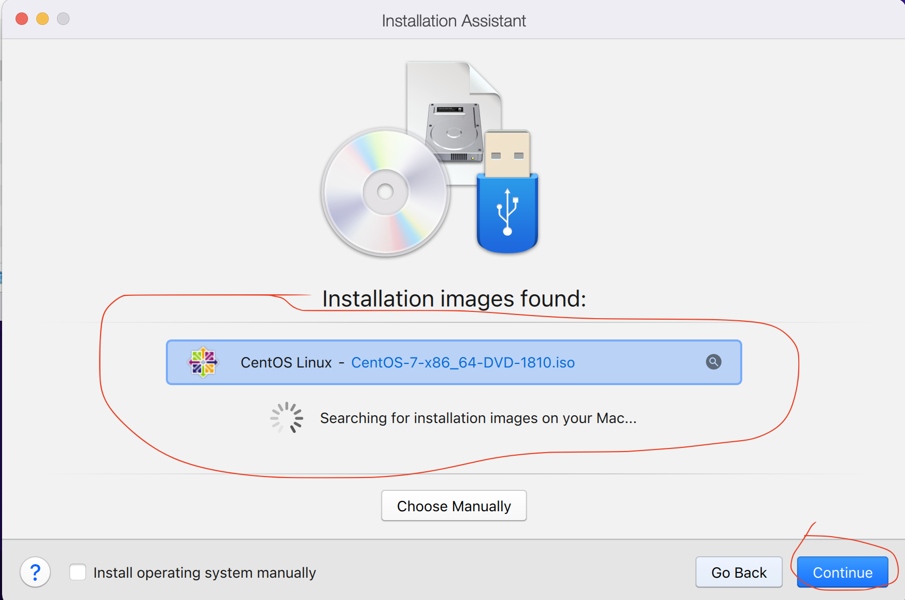

# Lab for VM management in Parallels


Step 1. Open a Parallels on Mac


Step 1a. (optional) Cancel update offer

Step 1b. (optional) Close Windows7 window if it appeared and keep only **Control Center** window


There is one VM is exist on our laptop, lets shut it down

Step 1c.(optional) Shut down existing VM with Windows 7.


Step 2. Create New VM

Click on "plus" icon to run Creation Wizard(Installation Assistant)


Step 3. Choose installation from DVD or image file


Step 4. Installation Assistant tries to find any images (.iso files) on Laptop for your choosing

Step 5. Choose first one with name **CentOS-Stream-9-latest-x86_64-dvd1.iso**



???+ note

     There many different Linux distributives like:
     - CentOS (freeware version of RHEL)
     - RHEL(Red Hat Enterprise Linux)
     - Debian
     - Ubuntu
     - etc

Step 6. Define new user for new Linux VM

It will be user which can login to our VM and do some actions

```
User Name: user1
Password: password1
Verify Password: password1
```


Step 7. Specify name of new VM and location of file with VM

???+ note

     Virtual Machine is a file actually and we can move it from one laptop/server ot another

???+ warning

     Each Hypervisor has own format of VM files and almost all of them are incompatible. That means we cannot create VM in Parallels, copy such file to other server and run it in KVM Hypervisor for example.


Dont forget to select Customize settings before installation to adjust CPU and RAM(memory) for new VM


Step 8. Configure VM settings(resources which will be allocated from your laptop/server to the VM)


Step 9. Allocate 1 CPU and and 1024 MB RAM and close such window


Step 10. Start VM initialization


Step 11. Run Linux installation

On the appearing screen choose  by arrows buttons first option **Install CentOS Stream 9** and press ENTER


???+ note

     Once you click on installation screen your cursor will be locked, to release it press CONTROL+OPTIONS on a keyboard

Step 12. Set Linux settings before installation

During this process we can choose which packages can be installed and configures various parameters for Linux Operation system like Language, user(which we specify above), network settings.

???+ note

     Once installed you can find your VM file here **/Users/your user/Parallels**.

     *.pvm is Parallels file extensing which means that it is VM is created by Parallels Hypervisor.

Step 12.1 Select language **English**


Step 12.2 Select Software packages for installation

Click on **Software Selection** and Choose **Minimal Install** and **Done**


Step 12.3 Confirm disk for Linux installation

Click on **Installation Destination** and **Done**


By default single disk is choosen and you don't need to select something. Just press Done.

Step

Step 12.4 Setup root(it is administrator) user

Click on **Root Password** option and specify password for **root** user.

Select  **Allow root SSH login with password** option

```
Root password: password1
Confirm: password1
```


???+ note

     Need to Press **Done** twice to confirm password for root user

Step 12.5 Add user

Click on **User Creation** and fill out the form

```
Full name: user1
User name: user1
Make this user administrator: yes
Require apassword to use this account: yes
Password: password1
Confirm password: password1
```


???+ note

     Need to Press **Done** twice to confirm password for root user

Step 13. Start Linux installation

Click on **Begin instalation**


Wait until button **Reboot System** become active and Press it.


After that installation, VM will reboot and you will see **terminal with login page*

???+ note

     Once installed you can find your VM file here **/Users/<your user>/Parallels**.

     *.pvm is Parallels file extensing which means that it is VM is created by Parallels Hypervisor.

Step 14. Login as user **user1**

Use password from steps above


Step 15. Get ip address of your new VM

Linux has command **ip** for getting information about ip addressess across all interfaces in Operation System.

Some servers/Laptops have more that one interface(for example one for management, second for data transfer to another servers)

Example:

```
ip a
```
**a** is argument means address. Literaly we can use

```
ip address - to show list of available interfaces and their ip addresses
```


Step 16. Write down IP address of your VM.
